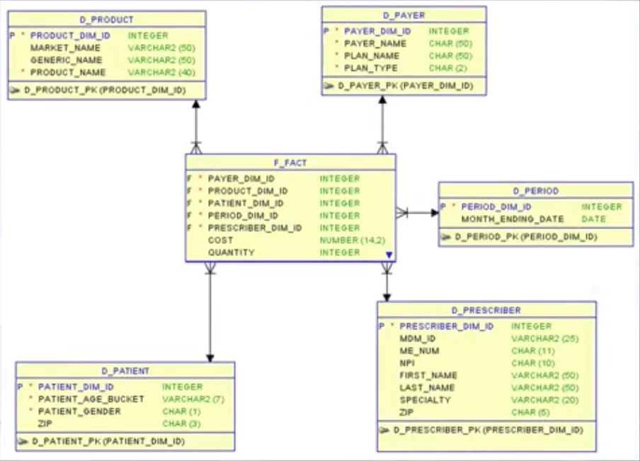
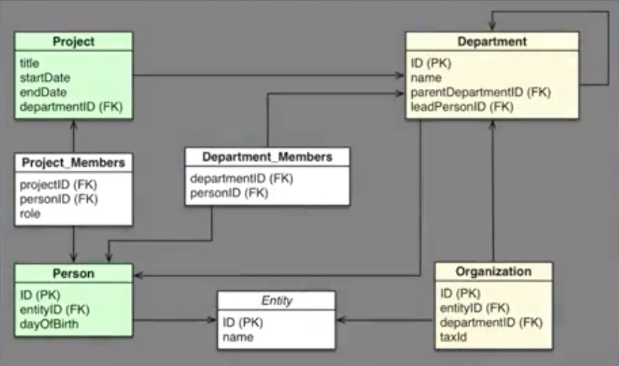
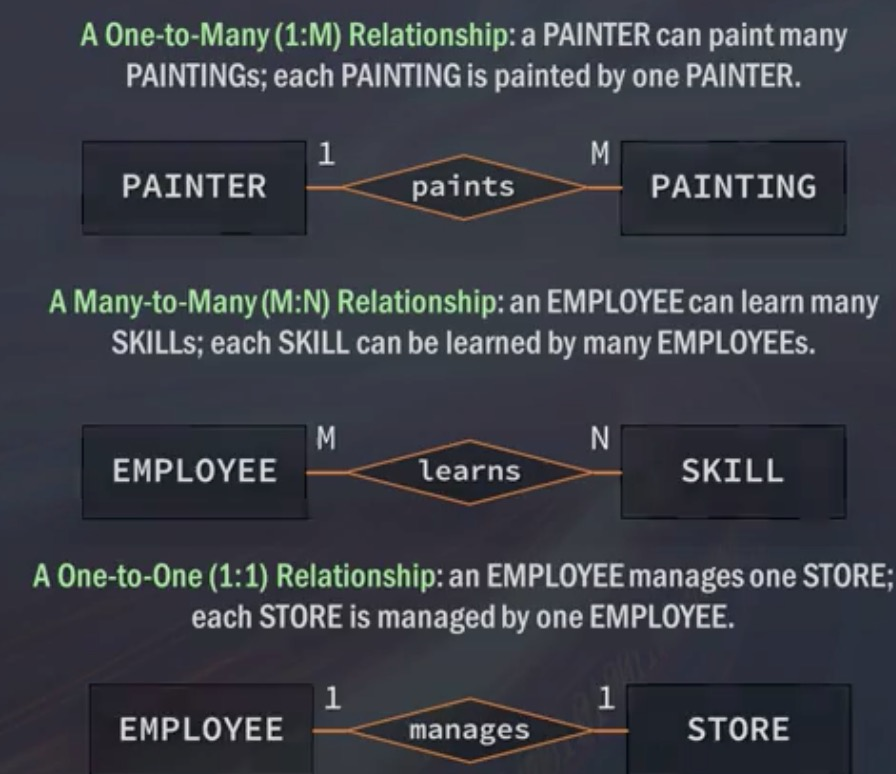
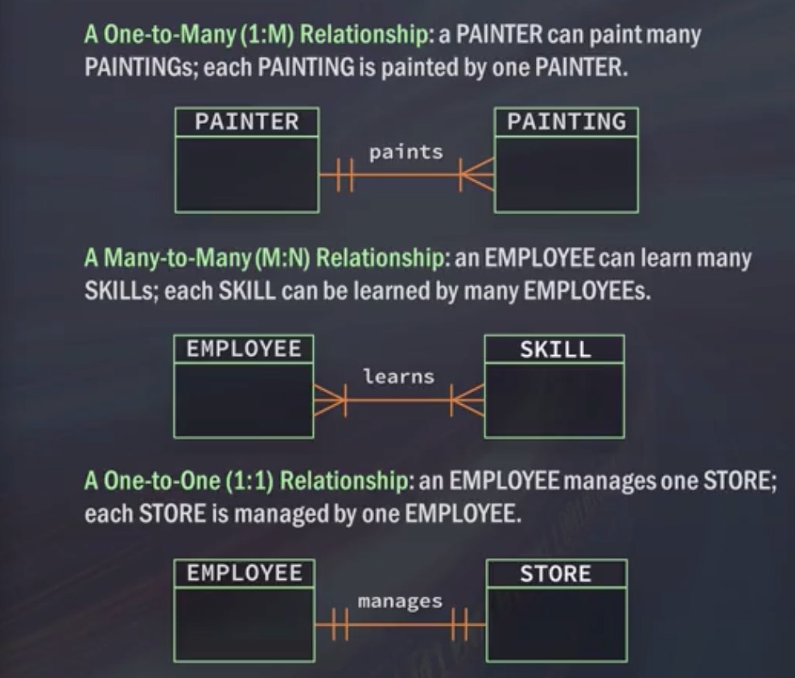
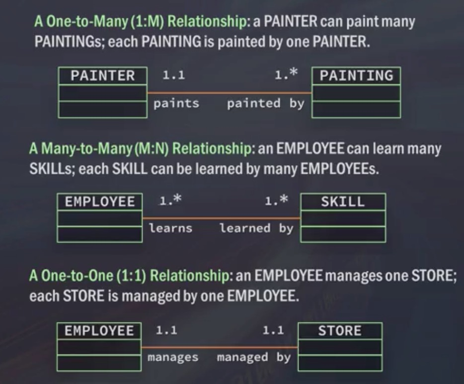

# Week 1 - Getting Started and Selecting & Retrieving Data with SQL

<!-- START doctoc generated TOC please keep comment here to allow auto update -->
<!-- DON'T EDIT THIS SECTION, INSTEAD RE-RUN doctoc TO UPDATE -->
**Table of Contents**

- [Data Models, Part 1: Thinking About Your Data](#data-models-part-1-thinking-about-your-data)
- [Data Models, Part 2: The Evolution of Data Models](#data-models-part-2-the-evolution-of-data-models)
- [Data Models, Part 3: Relational vs. Transactional Models](#data-models-part-3-relational-vs-transactional-models)
  - [Relational vs Transactional model](#relational-vs-transactional-model)
  - [Building blocks of data models](#building-blocks-of-data-models)
  - [ER diagrams](#er-diagrams)
  - [Primary and foreign keys](#primary-and-foreign-keys)
  - [ER diagram notations](#er-diagram-notations)
    - [Chen notation](#chen-notation)
    - [Crow's foot notation](#crows-foot-notation)
    - [UML class diagram notation](#uml-class-diagram-notation)
- [Retrieving Data with a SELECT Statement](#retrieving-data-with-a-select-statement)
  - [Limiting results](#limiting-results)
- [Creating Tables](#creating-tables)
  - [Inserting data](#inserting-data)
    - [Insert implicitly](#insert-implicitly)
    - [Insert explicitly](#insert-explicitly)
- [Creating Temporary Tables](#creating-temporary-tables)
- [Adding Comments to SQL](#adding-comments-to-sql)
  - [Single line comments](#single-line-comments)
  - [Multi-line comments](#multi-line-comments)

<!-- END doctoc generated TOC please keep comment here to allow auto update -->

## Data Models, Part 1: Thinking About Your Data

[video](https://www.coursera.org/learn/sql-for-data-science/lecture/emmOd/data-models-part-1-thinking-about-your-data)

It's important to think about requirements before implementing anything.
Front-loading this work saves time later.

## Data Models, Part 2: The Evolution of Data Models

[video](https://www.coursera.org/learn/sql-for-data-science/lecture/MJ3Q5/data-models-part-2-the-evolution-of-data-models)

- **data modeling:** the organising of multiple tables, and how they relate to
    each other
    - usually represents a business process
    - can help in understanding business processes
    - data models should always represent a real world problem as closely as
        possible

## Data Models, Part 3: Relational vs. Transactional Models

[video](https://www.coursera.org/learn/sql-for-data-science/lecture/HRlau/data-models-part-3-relational-vs-transactional-models)

### Relational vs Transactional model

- relational:
    - allows for easy querying and data manipulation
    - logical and intuitive querying
- transactional:
    - used for storing data, and not necessarily for querying data
    - e.g. medical database of patient data
    - data usually needs to be extracted into a relational model to be made
        sense of

### Building blocks of data models

1. entities
    - these are discrete 'things'
    - e.g. person, place, event, etc.
2. attributes
    - characteristics of entities
    - e.g. age, height, etc.
3. relationships
    - associations between entities
    - one-to-many
          - a customer's invoices
    - many-to-many
          - students assigned to classes
    - one-to-one
          - a manager for a store

### ER diagrams

ER (entity-relationship) diagrams are composed of entity types, and specify
relationships between those entities.


They have the following functions:

- show entity relationships
- show business processes
- are visual aids
- show links through primary keys



### Primary and foreign keys

Primary and foreign keys are the mechanism by which tables are related to each
other.

- primary key
    - a column, or set of columns, that uniquely identifies every row in a table
- foreign key
    - one or more columns that can be used together to identify a single row in
        another table



### ER diagram notations

#### Chen notation

Uses `1` and `M` to signify relationships on entities:



#### Crow's foot notation

- `--||-`: 1
- `--|ᗕ`:  many



#### UML class diagram notation

- 1.1: 1
- 1.*: many



## Retrieving Data with a SELECT Statement

[video](https://www.coursera.org/learn/sql-for-data-science/lecture/oN0Ks/retrieving-data-with-a-select-statement)

`SELECT` is used to retrieve data from tables, and `FROM` indicates where to
retrieve the data from.

Select one field from a table:

```sql
SELECT my_field
FROM my_table;
```

Select multiple fields from a table:

```sql
SELECT
  my_field_a
  , my_field_b
  , my_field_c
FROM my_table;
```

Select all fields from a table using a wildcard:

```sql
SELECT *
FROM my_table;
```

### Limiting results

To limit the number of results retrieved, use the `LIMIT` statement.

```sql
SELECT [fields]
FROM table_name
LIMIT quantity;
```

Syntax differs depending on the flavour of SQL.

## Creating Tables

[video](https://www.coursera.org/learn/sql-for-data-science/lecture/kuYRl/creating-tables)

```sql
CREATE TABLE table_name (
  id        [dataType] PRIMARY KEY,
  field_a   [dataType] NOT NULL,
  field_b   [dataType] NOT NULL,
  field_c   [dataType] NULL,
)
```

`id` is the primary key for the table - how we will reference this field from
other tables. Primary keys cannot accept `NULL` values.

`field_a` and `field_b` may not ever contain `NULL`. `NULL` is not the same as
falsy values in programming languages. An empty string or 0 are not `NULL`.
`NULL` indicates no presence of any value.

Fields that are defined as `NOT NULL` will return an error if not provided a
value.

### Inserting data

We use `INSERT INTO` and `VALUES` to define the table to write data to. There are two ways to
insert data; implicitly without field names, or explicitly with field names.

#### Insert implicitly

Given a table `shoes` with fields for `id`, `brand`, `color`, `price`, and `desc`:

```sql
INSERT INTO shoes
VALUES (
  1, 'Gucci', 'Black', '25000', NULL
);
```

#### Insert explicitly

Given a table `shoes` with fields for `id`, `brand`, `color`, `price`, and `desc`:

```sql
INSERT INTO shoes
(id, brand, color, price, desc)
VALUES
(1, 'Gucci', 'Black', '25000', NULL);
```

This method is more flexible, as we're not relying on column order, and we can
specify exactly which fields we want to write data to.

## Creating Temporary Tables

[video](https://www.coursera.org/learn/sql-for-data-science/lecture/3fVNc/creating-temporary-tables)

Temporary tables are useful when we want to clone a table, or get a subset of a
table without having to create an actual table.

Features of temporary tables:

- deleted once the session is over
- are faster to create than real tables
- are useful for complex queries that use subsets or joins

To create temporary tables, we use the `TEMPORARY` statement:

```sql
CREATE TEMPORARY TABLE sandals_temp AS (
  SELECT * from shoes
  WHERE shoe_type = 'sandals'
)
```

For MySQL there's no guarantee that a temporary table will be deleted. Dropping
temporary tables once they are no longer required is considered good practice.

```sql
DROP TEMPORARY TABLE sandals_temp;
```

Although there's nothing preventing one from creating a temporary table with the
same name as an existing table, it could lead to issues in deleting
non-temporary data.

## Adding Comments to SQL

### Single line comments

Use `--` to comment out single lines.

```sql
SELECT shoe_id
--, brand_id
, shoe_name
FROM shoes
```

MySQL allows for `#` to be used in addition to `--`.

### Multi-line comments

Use `/* */` to comment out multiple lines.

```sql
SELECT shoe_id
/*, brand_id
, shoe_name
*/
FROM shoes
```

