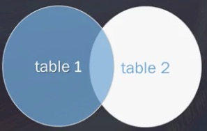
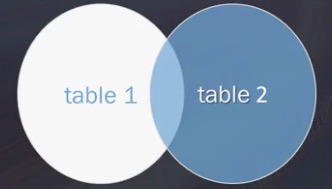
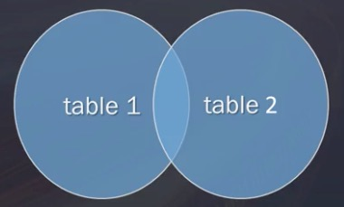
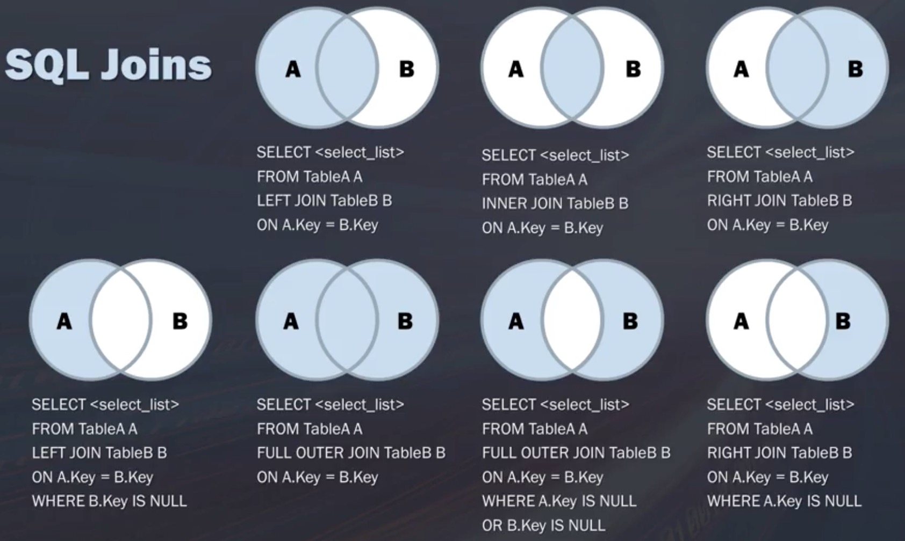

# Week 3 - Subqueries and Joins in SQL

<!-- START doctoc generated TOC please keep comment here to allow auto update -->
<!-- DON'T EDIT THIS SECTION, INSTEAD RE-RUN doctoc TO UPDATE -->
**Table of Contents**

- [Module introduction](#module-introduction)
  - [Joins](#joins)
- [Using subqueries](#using-subqueries)
  - [What are subqueries?](#what-are-subqueries)
  - [Problem: Get regions for customers who have ordered freight >= 100](#problem-get-regions-for-customers-who-have-ordered-freight--100)
    - [Combined with a subquery](#combined-with-a-subquery)
  - [Working with subquery statements](#working-with-subquery-statements)
- [Subquery Best Practices and Considerations](#subquery-best-practices-and-considerations)
  - [Subquery in a Subquery](#subquery-in-a-subquery)
  - [Subqueries for calculations](#subqueries-for-calculations)
  - [The power of subqueries](#the-power-of-subqueries)
- [Joining Tables: An Introduction](#joining-tables-an-introduction)
  - [Benefits of breaking data into tables](#benefits-of-breaking-data-into-tables)
  - [Joins](#joins-1)
- [Cartesian (Cross) Joins](#cartesian-cross-joins)
  - [Cartesian / Cross Join Example](#cartesian--cross-join-example)
  - [Different ways to create cartesian joins](#different-ways-to-create-cartesian-joins)
  - [Takeaways](#takeaways)
- [Inner Joins](#inner-joins)
  - [Qualifying and aliasing](#qualifying-and-aliasing)
  - [Best practices](#best-practices)
- [Aliases and Self Joins](#aliases-and-self-joins)
  - [Aliases](#aliases)
    - [Example](#example)
  - [Self joins](#self-joins)
- [Advanced Joins: Left, Right, and Full Outer Joins](#advanced-joins-left-right-and-full-outer-joins)
  - [Left join](#left-join)
  - [Right join](#right-join)
  - [Full outer join](#full-outer-join)
- [Unions](#unions)
  - [Union syntax](#union-syntax)
- [Summary](#summary)
  - [Best practices using joins](#best-practices-using-joins)
  - [Slowly do](#slowly-do)
  - [Joins and database performance](#joins-and-database-performance)
  - [Join syntax](#join-syntax)

<!-- END doctoc generated TOC please keep comment here to allow auto update -->

## Module introduction

[video](https://www.coursera.org/learn/sql-for-data-science/lecture/NDsRj/module-introduction)

Subqueries and joins are used to combine data from multiple tables.

### Joins

We'll learn about different types of joins:

- cartesian joins
- inner joins
- left and right joins
- full outer joins
- self joins

We'll also learn how to make queries cleaner and more efficient using aliases
and pre-qualifiers.

## Using subqueries

[video](https://www.coursera.org/learn/sql-for-data-science/lecture/FChaS/using-subqueries)

Using one table is useful, but a lot of value comes from using data from
multiple tables.

One of the ways to combine data from multiple tables is by using subqueries.

### What are subqueries?

Subqueries are queries embedded in other queries.

Relational databases store data in multiple tables. Subqueries merge data from
multiple sources together.

Subqueries are useful for adding additional filtering criteria.

### Problem: Get regions for customers who have ordered freight >= 100

With our currently limited knowledge of single table queries we would have to:

1. retrieve customer IDs for orders with freight over 100 from the `orders`
   table
2. retrieve customer details from the `customers` table
3. combine the two queries

e.g.

```sql
-- get customer ids
SELECT customer_id
FROM orders
WHERE freight >= 100;

-- get regions
SELECT customer_id, company_name, region
FROM customers
WHERE customer_id in (1,2,3,...);
```

#### Combined with a subquery

```sql
SELECT customer_id, comppany_name, region
FROM customers
WHERE customer_id IN (
  SELECT customer_id
  FROM orders
  WHERE freight >= 100
);
```

### Working with subquery statements

With subqueries, SQL will be performing two operations. The subquery is always
performed first.

When troubleshooting, always evaluate the innermost query first, as that is what
SQL will be evaluating first.

## Subquery Best Practices and Considerations

[video](https://www.coursera.org/learn/sql-for-data-science/lecture/3ubfD/subquery-best-practices-and-considerations)

- there is no limit to the depth subqueries one can use
- the more subqueries one uses, the more performance is impacted
- subquery `SELECT`s can only retrieve data for a single column at a time

### Subquery in a Subquery

1. get the order numbers for toothbrushes
2. get the customer ids for those orders
3. get the customer information for those orders

```sql
SELECT customer_name, customer_contact
FROM customers
WHERE customer_id IN (
  SELECT customer_id
  FROM orders
  WHERE order_number IN (
    SELECT order_number
    FROM order_items
    WHERE product_name = 'Toothbrush'
  )
)
```

[poorsql.com](http://poorsql.com) can be used to better format poorly formatted
SQL.

### Subqueries for calculations

Get the total number of orders for each customer:

```sql
SELECT
  customer_name
  ,customer_state
  (
    SELECT COUNT (*) AS total_orders
    FROM Orders
    WHERE Orders.customer_id = Customers.customer_id
  ) AS orders
FROM Customers
ORDER BY customer_name
```

Instead of using a subquery in a `WHERE` statement, we can use it inside a
`SELECT` statement.

### The power of subqueries

Although powerful, subqueries can have a performance impact. It' important to
evaluate other options for selecting data from multiple tables. Joins are often
more performant to use than subqueries.

## Joining Tables: An Introduction

### Benefits of breaking data into tables

- efficient storage
- easier manipulation
- greater scalability
- logically models a process
- tables are related through commong values (primary and foreign keys)

### Joins

Joins associate correct records from each table on the fly.

They allow for data retrieval from multiple tables in one query.

Joins are not _physical_ - they persist for the duration of the query execution.

## Cartesian (Cross) Joins

Like a cartesian product, each row in the first table joins with all the rows of
another table.


If a table 1 has 10 rows, and table 2 has 10 rows, then the result will have 100
rows. The result is always a new table of `NxM` rows.

As a result of the size of the new table, and computational cost, they are
infrequently used, but they are still valuable in certain situations. A deck of
cards can be created by creating a cartesian product of all face card types, and
the possible values each card can have.

### Cartesian / Cross Join Example

```sql
SELECT
  product_name
  ,unit_price
  ,company_name
FROM suppliers CROSS JOIN products;
```

### Different ways to create cartesian joins

If `LEFT JOIN` and `INNER JOIN` are used with `ON` or `USING`, SQLite will join
tables using a cartesian join strategy:

```sql
SELECT *
FROM A JOIN B;

SELECT *
FROM A
INNER JOIN B;

SELECT *
FROM A
CROSS JOIN B;

SELECT *
FROM A, B;
```

### Takeaways

Cross / cartesian joins:

- are not frequently used
- are computationally taxing
- will return columns with incorrect or incomplete data

## Inner Joins

[video](https://www.coursera.org/learn/sql-for-data-science/lecture/Dk0bv/inner-joins)

Inner joins are used to select records that have the same value in multiple tables.
An inner join is an intersection of two tables - records that are common as a
result of columns with matching values from each table.

This is where keys become important.

```sql
-- get company_name (from Suppliers table), product_name, and unit_price
SELECT
  -- qualify company_name so that we know it's coming from Suppliers
  Suppliers.company_name
  ,product_name
  ,unit_price
-- from the Suppliers table
-- where the suppliers have products in the products table
FROM Suppliers INNER JOIN Products ON Suppliers.supplier_id = Products.supplier_id;
```

The use of `[table_name].[columne_name]` is known as _qualifying_. This is
similar to qualified imports in Haskell. Qualifying makes it explicit which
table we are referring to when referencing a specific column.

- `INNER JOIN` is used as part of the `FROM` statement
- we use `ON` as a condition on which to match values in both tables
- without `ON` we'd simply have a cartesian join
- there is no limit to the number of tables one can join
- the more joins, the higher the impact on performance
- all the tables should first be listed, and only then should conditions be
    defined

### Qualifying and aliasing

To make it clear which tables and columns we're working with, we can use
qualified column names, and alias our tables so that we can eliminate some
typing when writing queries:

```sql
SELECT
  -- retrieve order id from Orders, aliased to o
  o.order_id
  -- retrieve company name from Customers, aliased to c
  ,c.company_name
  -- retrieve emplyee last name from Emplyees, aliased to e
  ,e.last_name
FROM (
  -- find the customers that have orders, aliasing Customers and Orders
  Orders o INNER JOIN Customers c ON o.customer_id = c.customer_id
  -- find the employees that are associated with the found orders
) INNER JOIN Employees e ON o.employee_id = e.employee_id;
```

### Best practices

- qualify column names so that you know where data is coming from
- do not make joins unneccessarily - joins are expensive
- think about the type of join you are making
- consider how records are connected

## Aliases and Self Joins

[video](https://www.coursera.org/learn/sql-for-data-science/lecture/cQKUS/aliases-and-self-joins)

### Aliases

Aliases give tables or columns a temporary name, and make column names more
readable.

Aliases exist only for the duration of a query.

```sql
SELECT column_name
FROM table_name AS alias_name;
```

#### Example

Without aliases:

```sql
SELECT
  vendor_name
  ,product_name
  ,product_price
FROM Vendors, Products
INNER JOIN Vendors.vendor_id = Products.vendor_id;
```

With aliases:

```sql
SELECT
  v.vendor_name
  ,p.product_name
  ,p.product_price
FROM Vendors AS v, Products as p
INNER JOIN v.vendor_id = v.vendor_id;
```

### Self joins

Self joins are joins that match records in a table with other records in the
same table.

An example would be finding customers that are in the same city:

```sql
SELECT
  a.customer_name AS c_name1
  ,b.customer_name AS c_name2
  a.city
FROM Customers AS a, Customers as B
WHERE a.customer_id != b.customer_id
  AND a.city = b.city
ORDER BY a.city;
```

## Advanced Joins: Left, Right, and Full Outer Joins

[video](https://www.coursera.org/learn/sql-for-data-science/lecture/993cg/advanced-joins-left-right-and-full-outer-joins)

SQLite only does `LEFT` joins. Other DBMSs use all joins.

### Left join

Returns all records from the left table, and all matching records from the right
table.

If there is no match on the right, the result is NULL.



e.g. an `INNER JOIN` on customers and orders would result in a table with only
customers who placed orders and their orders. A `LEFT JOIN` would result in a
table with all customers, even those without orders, and all the orders, too.

```sql
-- get all customers, as well as orders for those customers who have orders
SELECT
  C.customer_name
  ,O.order_id
FROM Customers AS C
LEFT JOIN Orders AS O ON C.customer_id = O.customer_id
ORDER BY C.customer_name;
```

### Right join

A `RIGHT JOIN` is similar to a `LEFT JOIN`, except that all records from the
right table are returned, with only matching records in the left table.



The result from the left table will be NULL if there is no match.

```sql
-- get all employees, as well as orders assigned to employees that have orders
-- assigned to them
SELECT
  O.order_id
  ,E.last_name
  ,E.first_name
FROM Orders as O
RIGHT JOIN Employees as E ON O.employee_id = E.employee_id
ORDER BY E.employee_id;
```

Right joins can be turned into left joins by reversing the order of the tables.
The same applies to left joins being made into right joins.

### Full outer join

A full outer join will return all results from both tables.



```sql
SELECT
  C.customer_name
  ,O.order_id
FROM Customers AS C
FULL OUTER JOIN Orders AS O ON C.customer_id = O.customer_id
ORDER BY C.customer_name;
```

## Unions

[video](https://www.coursera.org/learn/sql-for-data-science/lecture/KxGPs/unions)

A `UNION` is used to combine the result-set of multiple `SELECT` statements.

To create a union:

- each `SELECT` statement must have the same number of columns
- the columns in each `SELECT` statement must be in the same order
- the matching columns must have similar data types

### Union syntax

```sql
SELECT [column_names] FROM table1
UNION
SELECT [columns_names] FROM table2
```

e.g. getting records from `Customers` and `Suppliers` when evaluating a specific
country:

```sql
SELECT city, country
FROM Customers
WHERE country = 'Germany'

UNION

SELECT city, country
FROM Suppliers
WHERE country = 'Germany'

ORDER BY city
```

## Summary

[video](https://www.coursera.org/learn/sql-for-data-science/lecture/xEejU/summary)

### Best practices using joins

- it's easy to get results - it's important to confirm that they are the
    correct results
- validate the number of records returned against what you expect
- is the result logical given the kind of join performed?
- check for duplicates
- check the number of records each time you make a new join

### Slowly do

- think about what you are trying to do before doing it
- map how you are joining tables
- consider what your query is trying to do

### Joins and database performance

- the more joins, the slower the database will perform
- don't grab unnccessary data if you don't need to
- be strategic
- take only what you need

### Join syntax

Check the join syntax for the RDMS you are using.

SQLite doesn't make use of `RIGHT` joins.


